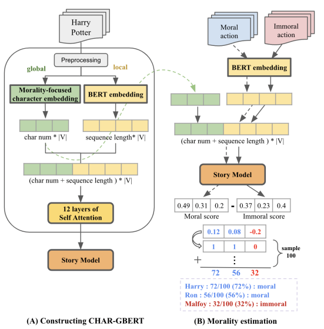

# CHAR-GBERT: CHARacter Graph BERT for Building Morality-Centric Character Embeddings

Authors: Su Young Bae, Yun Gyung Cheong

Creating compelling narratives is crucial for story-driven
fields, including entertainment, education, journalism, and market-
ing. A crucial aspect that makes a story captivating is the presence
of distinct moral boundaries, which allow us to discern moral con-
flicts between characters, encouraging readers to engage more mean-
ingfully with the characters and explore the underlying themes and
dilemmas presented in the story. To address this challenge, we pro-
pose CHAR-GBERT, a Character Graph BERT model that combines
a morality-focused character network with a BERT language model,
emphasizing the moral interactions between characters in a story. We
train our model on individual stories and employ an automated pro-
cess to assess a character’s morality using a refined moral annotated
dataset. The results demonstrate that our model outperforms conven-
tional baselines, making more precise and accurate estimations.




## 1. Requirements
- Python 3.7.15  
- Pytorch 1.13.1  
- AllenNLP 2.10.1  
- NLTK 3.7
- NetworkX 2.6.3  
- StellarGraph 1.2.1  
## 2. Prepare Datasets
#### 2.1 Story datasets
We collected 12 story datasets from Project Cutenbery, IMSDb, and Kaggle.    
The raw and preprocessed dataset is in `data/story_dataset/raw` and `data/story_dataset/clean`.
The list of 12 story datasets are in `data/story_dataset/datainfo.csv`.

#### 2.2 Moral datasets
We use two extracted evaluation moral datasets from [moral stories](https://github.com/demelin/moral_stories) dataset (`data/moral_dataset/one_moral_dataset.csv`).  
The preprocessed datasets for two estimation tasks are in `data/moral_dataset/moral_df_101.csv` and `data/moral_dataset/moral_df_mfd2.0_3792.csv`.


## 3. Extract moral sentences
#### 3.1. Preprocessing Moral Stories dataset
```
cd models
python -m extract_moral_sentences --ds moral_stories
```
#### 3.2. Overall morality estimation dataset : moral_df_101
```
python -m extract_moral_sentences --ds overall
``` 
#### 3.3. MFT values estimation dataset : moral_df_mfd2.0_3792
```
python -m extract_moral_sentences --ds mft
``` 
#### 3.4. Extract moral sentences in each story
```
python -m extract_moral_sentences --ds story
``` 


## 4. Make Character Embeddings
- Make 4 character embeddings in each story.
- baselines are `w2v`, `avg`, `co-occurrence`, and `moral-centric`.
- Output model files are in `outputs/graph_models`.
```
cd models
python -m character_embedding --mode train
```

## 5. Finetuning CHAR-GBERT
- fine-tuning CHAR-GBERT model and our baselines.
```
cd models
python -m training --ep 30 --bs 50
```
## 6. Estimation
- There are two evaluation options; `overall`, and `mft`.
```
cd models
python -m evaluation --eval mft
```


## 6. Estimation
# CHAR-GBERT
